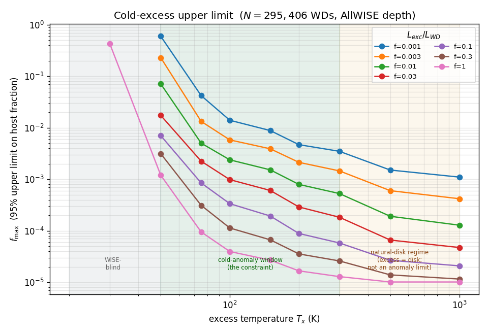

# Results

Results from running the registered pipeline (tag `registered-1.0`) on real archival
data. All numbers are reproducible from the committed code (`pipeline/`), the frozen
manifests (`data/manifests/`), and the pinned sources (`SOURCES.md`); granular build
decisions are in [`pipeline/IMPLEMENTATION_LOG.md`](pipeline/IMPLEMENTATION_LOG.md).

**Scope of this document (v1).** It covers all three registered channels: **A — static
infrared excess** (end to end, incl. NEOWISE time-variability), **B — TESS transit
morphology** (incl. difference-image centroid vetting), and **C — the accretion
clean-zone** corroborating flag. This is a first, un-reviewed pass with the stated
caveats below — not a final paper.

---

## The pipeline run

| Stage | Result |
|-------|--------|
| Frozen sample (Gaia EDR3 WDs, `P_WD>0.75`) | **359,073** white dwarfs |
| AllWISE cross-match (Gaia precomputed) | **16,924** with W1–W4 photometry (4.7%) |
| — per-band detections | W1 16,897 · W2 9,081 · **W3 650** · **W4 339** |
| Optical photosphere baseline (Bergeron DA) | 295,406 with a pure-H Teff (median 10,883 K) |

## Channel A — static infrared excess

### Validation: the known debris-disk population is recovered

Fitting a blackbody to the **923** W3/W4-excess SEDs (the cooler bands, where the
photosphere is negligible so any detection is a real excess) yields, for the 705 with
≥2 excess bands:

- **536 natural** sources — 426 warm debris disks + 110 cool/brown-dwarf companions —
  with **median T_x ≈ 511 K**, exactly the textbook white-dwarf debris-disk regime.

That the pipeline cleanly recovers the expected astrophysics is the key validation: the
"explain-away" machinery demonstrably explains the things it should.

### The cold-candidate gauntlet (the explain-away in action)

104 objects instead fit a **cold** (T_x < 300 K) blackbody — the potentially interesting
regime. Each was put through the registered natural-explanation battery:

| Filter | Survivors |
|--------|-----------|
| cold-fit candidates | 104 |
| − contamination flags (`cc_flags`, `ext_flag`) | 97 |
| − W3/W4 reliability (ph_qual A/B, S/N ≥ 5) | 12 |
| − **cirrus** (SFD `E(B-V)`; all 12 had 0.30–1.22) | **0** |

**Zero survive.** Every cold candidate has a concrete natural cause — a marginal
detection, a contaminated frame, or (for all 12 that reached the last filter) Galactic
cirrus in the WISE beam. A null reached by *explanation*, not assertion.

### Result: a clean, explained null

Channel A's static-excess branch finds **no unexplained infrared excess** at any
temperature, while recovering ~536 natural disks/companions. This is the *expected*
outcome (§4.A: WISE's reddest band is 22 µm, so it cannot detect genuinely cold dust),
and it is consistent with the pre-registered prediction of a valuable null.

## RQ4 — the cold-excess upper limit `f_max`

With zero unexplained excesses, the registered zero-detection bound
`f_max = 3.0 / Σ_i C_i` (§5.7) was computed over all **295,406** WDs with a photosphere,
using survey-depth injection-recovery (a WD constrains an excess of temperature `T_x`
and bolometric-luminosity fraction `f` if it would have exceeded the AllWISE 5σ depth).

Three regimes (see figure):

- **T_x ≲ 50 K — WISE-blind.** Below W4's reach → unconstrained. The genuinely cold,
  most-interesting regime needs far-IR (Herschel / JWST-MIRI).
- **~50–300 K — the cold-anomaly window** (a cold excess is both WISE-detectable *and*
  distinguishable from a warm disk). With zero found, **`f_max ≈ few×10⁻³ to 10⁻⁴`**.
  *E.g. at `T_x = 100 K` reprocessing 10% of the WD's light (`f = 0.1`):
  `f_max ≈ 3×10⁻⁴`* — fewer than ~0.03% of white dwarfs host such an unexplained excess.
- **T_x ≳ 300 K** — any excess is classified as a natural debris disk (~536 found, all
  natural); the tight numbers there are a generic IR-excess limit, **not** an anomaly limit.

In plain terms: **fewer than ~0.01–0.1% of (predominantly solar-neighborhood) white
dwarfs host an unexplained cold (50–300 K) infrared excess**, with the colder regime
currently beyond WISE's reach.

## Channel A — time-variability (NEOWISE)

The §1.1 highest-value signature is a *fluctuating* excess — something a static disk
cannot fake. We pulled NEOWISE-R multi-epoch W1/W2 light curves for the IR-excess
candidate set (**80,379 clean epochs for 807 WDs**, via a bulk IRSA-TAP spatial
cross-match) and computed, per source, the reduced χ² (amplitude) and the **Stetson J**
index (correlated W1/W2 variability — the "structured" proxy), both empirical-null
calibrated. The NEOWISE per-epoch errors are well-calibrated (χ²_red null centred at 1.00).

Of **540** WDs with ≥10 epochs, **17** show significant correlated variability:

- **14 are natural** — debris-disk variability (a known phenomenon; §5.2 item 1) or
  brown-dwarf "weather." Several show striking ~0.4–1.3 mag events over the decade
  (`figures/variability_examples.png`) — useful variable-disk candidates in their own right.
- **3** were flagged only because the *static* battery hadn't classified their excess
  (single-band or hot fit); their light curves are marginal (few epochs / large errors) or
  consistent with bright-source systematics — candidates for further scrutiny, most likely
  natural, **not** compelling anomalies.

So the variability layer **works** (it cleanly recovers real disk variability) and finds
**no compelling anomalous fluctuation** — a null for the highest-value signal, with a
variable-disk byproduct.

### Expanded variability — the bare-WD population (removing the selection bias)

The v1 above only searched WDs that *already* had a static IR excess — a selection bias
(flagged in external review): a transient or sporadic event on an otherwise-bare WD averages
to the photospheric baseline and would be missed. We therefore re-ran the variability search
on a **brightness-limited** sample — **all** AllWISE WDs bright enough for NEOWISE
single-exposure detection (W1 < 15.5), excess or not: **271,520 clean epochs for 861 WDs**.
The empirical null self-recalibrates here (χ²_red δ₀=1.75, σ₀=0.25 — bright-source NEOWISE
errors are mildly underestimated), and **35** WDs pass the correlated-variability threshold.

Vetting each (SDSS class, SIMBAD, Gaia-neighbour blend in the ~6″ beam, and IR excess):

- **28 are natural** — the strong variables are **cataclysmic variables** (accreting WD
  binaries: EF Eri, IW Eri, BW Scl, …), **aperture blends** with a neighbour in the NEOWISE
  beam, or **IR-excess systems** (an unresolved companion or a *variable dust disk* — the
  search cleanly recovers the textbook example **GD 56**). See `figures/variability_bright.png`.
- **7 residual** — all **low-significance (Stetson J ≤ 1.9), isolated, with no IR excess**:
  consistent with the empirical-null statistical tail / NEOWISE systematics, not compelling
  anomalies (a couple are ROSAT X-ray WDs, i.e. likely magnetic/accreting).

**No anomalous fluctuating bare white dwarf.** Removing the selection bias and searching the
previously-invisible bare-WD population still yields a clean null: every high-significance
variable has a natural cause, and the residual is a marginal statistical tail. The search
also validates itself by recovering known CVs and GD 56's variable disk.

## Channel B — TESS transit morphology (secondary)

Channel B is registered as **secondary and candidate-generating** (§5.4): TESS is
photon-starved on faint WDs, so it runs only on the bright subset (Gaia **G < 14 → 157
WDs**; just 566 reach G<15, of 359k). The Box-Least-Squares machinery was validated by
recovering the known deep transiter **WD 1856+534 b (P = 1.4080 d** vs. truth 1.4079).

Of 157 bright WDs, **136** had usable TESS light curves. The strongest periodic signals
are **stellar variability, not transits** — of the top 9 by BLS S/N, six are smooth
sinusoidal modulations (ellipsoidal/reflection/pulsation; duty cycle 0.19–0.33), and
SIMBAD confirms most are already catalogued (WG 21, FBS 0702+616, WG 17 [binary],
**HZ 43B** [a known WD+dM pair], **SH 2-216** [planetary-nebula central star], a
high-proper-motion star).

**Three** signals are genuinely transit-shaped (duty cycle ≤ 0.02, not sinusoidal, no
SIMBAD entry): Gaia `2660358032257156736` (P=0.258 d), `6348672845649310464` (P=4.088 d),
`5274517467840296832` (P=5.394 d). All three are **shallow (0.7–1.2%)** — and a planet
transiting a white dwarf (an Earth-sized star) would produce a *deep or total* eclipse, so
a ~1% dip **cannot be a transit of the WD itself**. Each also has a faint Gaia neighbour
(ΔG ≈ 3.9–4.9; 1–3% of the WD flux) whose light, under a deep eclipse, matches the observed
shallow depth — pointing to a **blended/background eclipsing binary** in TESS's 21″ pixels.

We then ran the registered difference-image **centroid (BEB) test** (§5.2 item 9): build
the mean pixel image in- vs out-of-transit, and locate the flux-weighted centroid of the
difference. **All three centroids are off the white dwarf** — offsets of **0.76–1.56 px
(16–33″)**, each toward the field/neighbour, not the WD. So the dips do not originate on
the white dwarfs: they are **confirmed background/blended eclipsing binaries**, exactly the
natural false-positive this test exists to catch. Figures: `figures/transit_candidates.png`,
`figures/centroid_vet.png`.

**Channel B: a clean, fully-vetted null — no transit-of-a-WD anomaly.** The loud signals
are (mostly already-catalogued) stellar variables, and every transit-shaped residual is an
off-target eclipsing binary by difference-image centroiding. As registered, Channel B is a
secondary, candidate-generating channel limited to the bright (G<14) subset; a full search
to fainter magnitudes and across all sectors is a future extension.

> **Integrity note (logged in full in `pipeline/IMPLEMENTATION_LOG.md`).** A routine
> "do all candidates trace back to the parent sample?" check caught a bug: 19-digit Gaia
> `source_id`s overflow float64's exact range, and one all-numeric pandas `iterrows` row
> in the transit step silently corrupted 99/157 id *labels* (the BLS results, which depend
> only on coordinates, were unaffected). A full pipeline audit confirmed **no Channel-A
> result was touched** (those rows carry a string column that protects the id). Fixed by
> carrying `source_id` as a **string** throughout; the transit table was repaired in place
> and verified by an exact per-row `g_mag` match.

## Channel C — accretion clean-zone (corroborating only)

Channel C (RQ3) asks whether any *polluted* (actively accreting) white dwarf shows an
anomalously **clean inner zone** — accreting yet no inner dust. It is registered as an
**ordinal corroborating flag with no standalone threshold** (§5.5): "accreting but no
detectable dust" is common and natural, so per §5.6 it elevates an object **only when it
coincides with a Channel-A or -B survivor**.

We identify the polluted WDs deterministically from the *same pinned* Gentile Fusillo 2021
catalogue — its `sdssspec.dat` table of SDSS visual spectral classifications — taking every
WD class containing **Z** (Ca H&K metal lines): **894** unique polluted WDs in our P_WD>0.75
sample (mostly DZ, plus DAZ/DBZ/DBAZ/…; the table carries multiple spectra per WD, so it is
deduplicated to one row per source — a WD counts as polluted if *any* of its spectra shows
metals). Of these, **112** have AllWISE coverage, so inner dust *could* be seen. Using the
calibrated, photosphere-independent disk detection (the Channel-A W3/W4 battery — deliberately
**not** a raw W1/W2 cut, which Channel A showed is inflation-dominated), **5 (4.5%) are
disk-bearing and 107 (95.5%) have a clean inner zone.** Only a few percent showing a disk —
with a clean zone the norm — is the expected, literature-consistent picture. The clean state
is natural (gas-only or
optically-thin disks, recently-fully-accreted events; §5.2 item 10), and many non-detections
are simply sensitivity-limited (item 11).

**Coincidence (the only elevation rule):** with **0 Channel-A residual survivors** and
**0 Channel-B on-target survivors**, the clean-zone set (107 WDs) intersects the A∪B
survivors in **0 objects**. Channel C therefore contributes **no elevated anomaly** — exactly what its
corroborating-only registration anticipates — while leaving a useful byproduct: a
characterised polluted-WD / clean-inner-zone catalogue
(`data/derived/channel_c_clean_zone.parquet`).

## v2 amendment — deeper W1/W2 (CatWISE2020)

A pre-registered extension ([`preregistration_v2_unwise.md`](preregistration_v2_unwise.md),
frozen before the data) deepening the W1/W2 excess search and the warm-regime `f_max` with
**CatWISE2020** (Marocco et al. 2021), ~1.4–1.75 mag deeper than AllWISE in W1/W2.

**Cross-match.** 91,197 WDs have CatWISE2020 W1/W2 — **5.4× the AllWISE sample, 75,060 of
them new** — with W2 reaching ~20.5. After the frozen cuts (nearest <2″; reject if a second
source <3″; SNR≥5): 60,446 WDs.

**Empirical null.** The deeper, cooler sample's photosphere-prediction scatter is even larger
(genomic-control λ ≈ 19 in W1, 29 in W2, vs v1's 10.6) — re-confirming the empirical-null
calibration as a structural necessity. W1 cross-calibrates cleanly to AllWISE (+0.004 mag);
W2 carries a small catalogue offset (+0.04…+0.17) that the per-band empirical null absorbs and
W1 corroboration cross-checks (W1 is the clean ruler; 99.4% of W2 detections have a W1).

**Excess census.** Requiring **W1+W2 corroboration** reduces 5,035 single-band W1 flags to
**866 robust warm excesses** — 51 already-known AllWISE disks/companions, 44 SDSS binaries/CVs
(WD+MS, cataclysmic variables), and 774 warm debris-disk/companion candidates. **By
construction every W1/W2 excess is warm** (a cold 50–150 K excess does not emit detectably at
3.4/4.6 µm), so the deeper search extends the warm-disk/companion census but **cannot** surface
a cold-anomaly candidate.

**Upper limit.** Recomputing `f_max` with the deeper W1/W2 depths (W3/W4 unchanged), the
**cold-anomaly window (50–300 K) is W3/W4-limited and unchanged** (1.0–1.2×); only the >300 K
natural-disk regime tightens (~2×). This confirms *with data* that the headline cold limit is
W4-limited and that **far-IR (JWST/Herschel), not deeper W1/W2, is the only path** to improving
it. Figure: `figures/f_max_v2.png`.

**v2 bottom line:** a clean, pre-registered confirmation — no cold anomaly (impossible by
wavelength), the headline limit unchanged, and a 5.4× larger warm-excess census (all natural)
as a byproduct.

## Caveats

- **Nominal, uniform WISE depths** for `f_max`; position-dependent depths would refine it.
- **AllWISE detections only** for the excess search; the non-detected majority enters the
  limit through survey depth, not forced photometry. **CatWISE/unWISE** would deepen W1/W2.
- **DA (pure-H) photosphere grid** is used for all WDs, but the null is **robustness-checked**
  against it (`pipeline/analysis/11_db_robustness.py`): re-predicting the 25 spectroscopically
  He-atmosphere W3/W4-excess WDs with the **DB grid** at (Teff_He, logg_He) shifts predicted
  W1/W2 by only ~0.06 mag, and in W3/W4 — where the cold candidates are defined — the
  photosphere is <0.6% of the observed flux under *both* DA and DB. With elimination driven by
  cirrus/reliability (photosphere-independent), all 3 He-atmosphere cold candidates remain
  resolved. The cold null does not depend on the atmosphere assumption. For the **f_max**
  limit specifically (`11`/`12`): excluding the spectroscopically-confirmed non-DA WDs
  (~1.6% of the sample) leaves `f_max` unchanged (3.4×10⁻⁴ at T=100 K, f=0.1, vs 3.4×10⁻⁴
  for the full sample); a confirmed-DA-only limit is ~9× weaker *only* because N is ~18×
  smaller. The limit is robust to the DA assumption.
- **Solar-neighborhood selection bias** and possible local-environment effects on the
  natural baseline (stated in §3) apply to the interpretation of `f_max`.
- The cirrus ceiling, natural-temperature boundaries, and trial-factor are pre-data
  choices logged in `IMPLEMENTATION_LOG.md`; some are flagged for empirical refinement.

## Reproducibility

Sample/cross-match/baseline: `pipeline/fetch/01–03`, `pipeline/build/01`. Channel-A
analysis: `pipeline/analysis/01_ir_excess` → `02_empirical_null` (diagnostic) →
`03_battery` → `04_vet_cold` → `05_upper_limit`. Figures in `figures/`. Bulk data is
fetched on demand (gitignored) per `SOURCES.md`; the recipe is committed.

## What's next

All three registered channels have now had a first end-to-end pass (all clean nulls).
Remaining work, each entering as a dated pre-data amendment (§8):

1. **`f_max` refinements** — CatWISE/unWISE forced photometry; position-dependent depths;
   far-IR (Herschel/JWST-MIRI) to reach the sub-50 K regime WISE is blind to.
2. **Channel B to fainter mags / all sectors** — and upgrading it toward a calibrated
   channel as better time-domain data arrive (the §5.3 extensibility clause).
3. **Full-sample variability** — to catch pure transients with no static excess.
4. **Domain-expert review** of the whole pass before any write-up.
