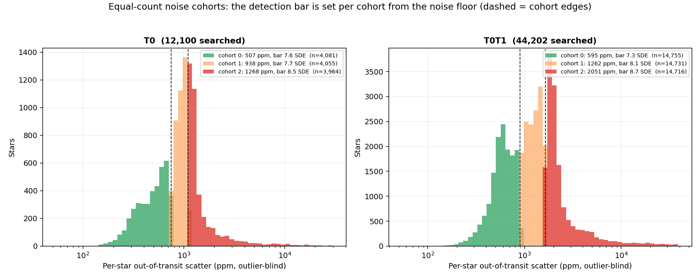
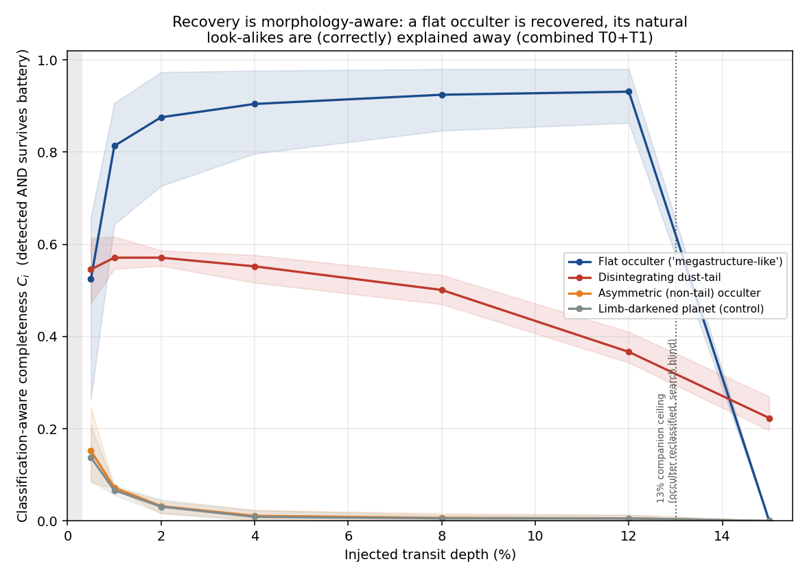
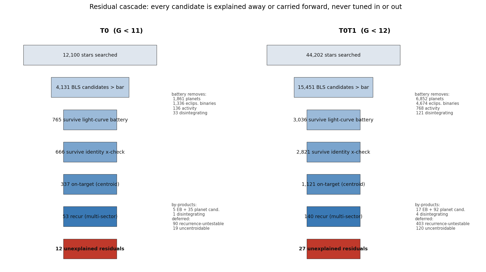
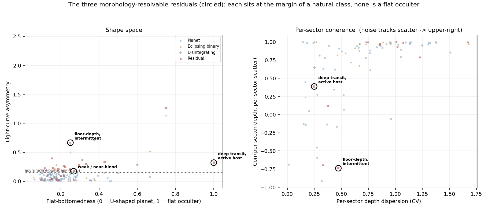
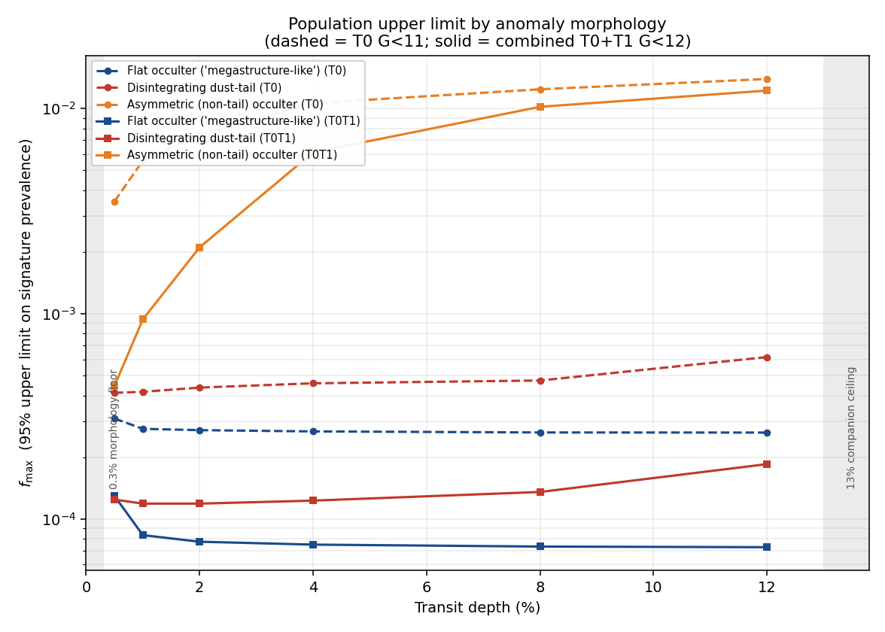

# A Pre-Registered, Mechanism-Agnostic Search for Anomalous Transit Signatures Around Main-Sequence K Dwarfs: Bright-Tier (G < 12) Results

**Tonio Loewald**

Independent Researcher · tloewald@gmail.com
<!-- TODO before submission: confirm affiliation (institution or "Independent Researcher") and add ORCID -->

**Status: DRAFT for review.** Phase 2 of the program whose Phase 1 (white dwarfs) is published
and registered at OSF [10.17605/OSF.IO/6YH7R](https://doi.org/10.17605/OSF.IO/6YH7R). The Phase-2
plan was registered at OSF [osf.io/2akn3](https://osf.io/2akn3/) before any K-dwarf light curve was
analysed; this paper reports the executed search over the two brightest tiers — T0 (G < 11), the
registered headline tier, and a combined bright sample T0+T1 (G < 12) that tightens the
flat-occulter limit threefold. The deeper search leaves a short list of morphology-resolvable
residuals — none a flat occulter — reported transparently as residuals the frozen battery cannot
auto-classify, with their committed diagnostics and the battery limitations they expose.

## Abstract

We report the two-tier result of a pre-registered, mechanism-agnostic search for anomalous
transit signatures around main-sequence K dwarfs. Rather than assume what an enduring intelligence
would build, the search looks only for a departure from the natural transit model — most powerfully
a transit *shape* no natural occulter can produce — and attempts to explain every candidate away
through a fixed, pre-registered battery of natural hypotheses. Detection thresholds are not chosen
but *computed* by a registered procedure (a per-noise-cohort empirical null calibrated on the lower
bulk of the statistic, plus injection-recovery completeness) and frozen before the candidate tail is
unblinded.

Applied first to 12,100 bright (G < 11) K dwarfs and then to a combined 44,202-star bright sample
(G < 12) with TESS photometry, the pipeline reduces the box-least-squares candidates through an
identity cross-check, a difference-image centroid gate, a multi-sector recurrence test, and a
multi-sector morphology triage. **No candidate is claimed as a detection.** In the regime where
transit morphology is resolvable (depth ≳ 0.3%, the floor set by the pre-registered injection pilot),
the automated battery leaves a short residual list — two objects in T0, two in the combined run,
three distinct in all. **None is a flat-bottomed occulter.** We do not adjudicate them away one by one
(that would be the candidate-by-candidate reasoning the registration forbids); we report them as
residuals the frozen battery cannot auto-classify, with the committed diagnostic metrics that place
each at the margins — a deep transit on a high-variability host the sinusoid activity gate cannot see,
a weak-statistic near-blend, an intermittent floor-depth signal — and defer their disposition to
declared, uniformly-applied battery improvements (§3.5) rather than to prose. Completeness is
classification-aware: an injected anomaly is counted only if it both is detected and survives the
battery as a residual, bounding the anomaly→natural leakage directly in the limit. The result bounds
the rate of **detectable anomalous transit *signatures* within the searched range** (period < 13 d,
0.3% ≲ depth ≲ 13%, shape matching a forward-modelled family): for flat-occulter ("megastructure-like")
morphologies at 1% depth **f_max ≈ 2.8×10⁻⁴ (T0) tightening to ≈ 8.3×10⁻⁵ (combined)** (a ~3% move
from the battery refinement, within injection sampling); for disintegrating-tail-like ones
**≈ 4.2×10⁻⁴ → ≈ 1.2×10⁻⁴** — the tail limit ~25% looser than an earlier draft after review showed the
depth-variability test needed a red-noise-aware floor (§3.3), and intrinsically loose because a
strongly-asymmetric tail is near-degenerate with a natural disintegrating body; an injection test
confirms the red-noise floor does not over-suppress (tail recovery is flat with host brightness).
Asymmetric occulters that are not tails are weakly constrained (C_i ≈ 0.06; f_max ~ 10⁻³), a bound we
report rather than omit. We state plainly what this leaves: of the three modelled anomaly
morphologies only the **flat occulter** is tightly bounded, and only over a 0.3% ≲ depth ≲ 13% window
— above ~13% (R_occ ≳ 2.5 R_J) a flat occulter is reclassified a stellar companion and **left
unconstrained**, a deliberate blind spot toward the largest occulters. These are signature rates, not
occurrence rates of the structures; the two relate as f_signature = f_structure · P_transit, and
within the searched range (a ≲ 0.1 AU) the geometric transit probability P_transit ~ R⋆/a runs
~3–30%, so a structure-occurrence rate would be larger by at most ~30× — while orbits beyond ~0.1 AU
are unsampled and unconstrained entirely. We show the conversion but decline to quote an occurrence
rate the data do not license. As a by-product the search flags eclipsing-binary and transiting-planet
candidates among K dwarfs not previously catalogued as such (5 + 35 in T0; 17 + 92 in the combined
sample); further candidates are carried explicitly as recurrence-untestable, sub-resolution, or
uncentroidable **follow-up targets**, none a detection. We frame the result not as a one-off null but
as the calibration of a reusable screening engine whose limit tightens automatically as photometric
precision, sky coverage, and time baselines improve. No claim of artificiality is made.

## 1. Introduction

This is Phase 2 of a program that reframes technosignature detection away from mechanism-assuming
SETI — searches that presuppose a construct such as a Dyson sphere or Kardashev-scale energy use
(Griffith et al. 2015; Zuckerman 2022; Suazo et al. 2024) — and toward the only thing an enduring
intelligence must produce to be detectable at all: an **anomaly** — a departure from the
well-modelled natural behaviour of a system that resists every natural explanation, the regime in
which unexplained stellar dimming (Boyajian et al. 2016) and proposed artificial transit signatures
(Arnold 2005) have historically drawn attention. The reframing also relaxes the longevity pessimism
of the Fermi paradox (Sandberg et al. 2018): we ask not whether enduring intelligence is common but,
conditional on its persistence, where it would be detectable. Phase 1 applied this anomaly-residual
method to white dwarfs and returned a clean, fully-explained null with a quantitative upper limit
(Loewald 2026a).

Phase 2 carries the same validated machinery to a *living* host. Among living stars, K dwarfs offer
the longest stable main-sequence lifetime (15–40 Gyr), the quietest photospheric baseline, and —
being small — the deepest, most morphologically-resolvable transits. The cost, stated in the
registration: a living star's cool photosphere is bright in the infrared, so the IR-excess channel
that anchored Phase 1 loses its contrast. Phase 2 is therefore **transit-anchored**: we search for
transit light curves whose shape (asymmetry, flat-bottomedness, box-versus-U, anomalous duration,
variable depth) cannot be reproduced by any natural occulter after those are explicitly fitted and
excluded.

The registration retained one further assumption — an activity-based youth-proxy floor, on the
premise that a host must be old enough for life to have originated. **We drop it, and declare the drop
as a registered deviation** rather than excise it silently. The premise does not survive scrutiny: it
is undefined (the only abiogenesis timescale is Earth's, N = 1, and the relevant clock for an enduring
*builder* is longer and less constrained still); for K dwarfs it is nearly vacuous (their 15–40 Gyr
main-sequence lifetimes exceed the age of the universe, so any K dwarf not conspicuously young clears
any Earth-calibrated bar by construction); and a biological-plausibility prior is precisely the kind
of mechanism assumption this program defines itself against. Dropping it costs nothing operationally —
the floor was never implemented as a sample cut (§2), so no candidate changes — and the activity it
would have keyed on is already handled where it belongs, on photometric-noise grounds: the battery
removes stellar activity as a false-positive class, and active (noisier) stars receive lower
completeness and so weight down in the limit. K dwarfs remain the target for the stability of their
long-lived, quiet platform and their deep, resolvable transits — properties of the host as an
*observing platform*, not a prior on its inhabitants.

The differentiator is not the transit channel, which is well-trodden, but the discipline: thresholds
fixed by a registered procedure rather than by inspecting candidates, and a mandatory, uniform
explain-away battery (for the breadth of the technosignature landscape this method sits within, see
the review of Wright 2018). We register the *method*, not the numbers (the pre-registered Phase-2
plan, Loewald 2026b); a reviewer judges adherence to the procedure, not the values it produced.

## 2. Sample and data

The parent sample is a frozen, checksummed manifest of 175,968 main-sequence K dwarfs from Gaia DR3
(Gaia Collaboration et al. 2023; Teff 3900–5300 K, log g > 4.3, RUWE < 1.4, parallax_over_error > 10,
within a main-sequence box; git tag `phase2-manifest-1.0`). The manifest is analysed in nested, brightest-first tiers, with the
expansion trigger being available compute rather than any result. This paper reports two tiers. Tier
**T0 (G < 11)** is 12,100 stars with a usable TESS (Ricker et al. 2015) SPOC (Jenkins et al. 2016),
TESS-SPOC (Caldwell et al. 2020), or QLP (Huang et al. 2020a, 2020b) light curve, detrended
with an upward-only outlier clip so transits are preserved (the remaining ~400 of the tier are
saturated-bright stars absent from standard photometric processing, recorded as unanalysable and
self-weighting to zero in the limit). The **combined bright sample T0+T1 (G < 12)** adds the next
tier and is searched jointly as **44,202 stars** with usable photometry, re-calibrated from scratch
on the larger noise floor (so the combined limit is not a stitch of two per-tier limits but a single
calibrated search; git tag `phase2-calibration-T0T1`). T0 is retained intact as the registered
headline tier and is reported alongside the combined result rather than superseded; the combined
calibration and residual lists are separate, immutable artifacts (`kdwarf_T0T1_*`).

The activity-based youth floor named in the registration is **dropped** (§1) — a registered deviation,
not deferred work — so the only sample cuts are the Teff / log g / RUWE / parallax / colour-magnitude
criteria above, and the full main-sequence K-dwarf manifest is searched. The floor was never
implemented as a cut, so dropping it removes no candidate and changes no number. Stellar activity
enters only on photometric-noise grounds (the battery removes it as a false-positive class, and active
cohorts carry lower completeness); the result below is a constraint on the full main-sequence
population.

## 3. Methods

### 3.1 Integrity invariant

No real candidate data are analysed before the detection thresholds are computed and frozen. The
registered procedure computes the per-cohort empirical null and the family-wise bar on the noise
floor and on synthetic and known-object injections only (the empirical null is estimated from the
*lower* bulk of the statistic, so the common real transits, which populate the upper tail, cannot
shift it); the candidate tail
is unblinded exactly once, against the frozen calibration. Sample, query, recipe, and per-stage
residual lists are committed in a public, branch-protected repository linked from the registration.

### 3.2 Calibration

Each star's out-of-transit noise is measured with an outlier-blind estimator — the median absolute
deviation of the continuum after iterative downward-only sigma-clipping — so a genuine deep dip
cannot inflate its own baseline and mask itself. Stars are binned into three equal-count noise
cohorts. Within each cohort, box-least-squares (BLS; Kovács et al. 2002) is run on every star's
light curve and the null location δ0 and scale σ0 of the detection statistic (the signal-detection-
efficiency SDE) are estimated from the **lower bulk** of the per-star distribution (the median and
the 15.9th percentile) — the empirical-null construction of Efron (2004), in which the null is read
off the data's own quiet bulk — so that the real transiting planets and binaries, which are common,
not rare, and populate the *upper* tail, do not bias the null. The family-wise detection bar is
δ0 + z·σ0 with z = Φ⁻¹(1 − 1/N_total), N_total the full 175,968-star manifest — a per-trial
significance in the spirit of the Kepler ~7.1σ detection threshold (Jenkins et al. 2002). We label
σ0² as a genomic-control factor λ (Devlin & Roeder 1999) by analogy with large-scale inference, but the BLS SDE is not a z-statistic, so values of
λ away from unity (here 0.61–1.15 across cohorts and tiers) carry no inflation/deflation meaning; λ is simply
the per-cohort bulk scale that sets the threshold (we retain the genomic-control reference for this
per-cohort scaling construction, not for an inflation correction, which the SDE does not admit). The bar is a **white-noise candidate-generation**
threshold: it controls pure-noise false alarms, but is deliberately permissive toward the real
astrophysical signals and red-noise/systematic outliers that any sensitive transit survey produces
(§4.1 — 34% of stars yield a candidate), which are removed *downstream* by the centroid and
recurrence stages rather than by the bar. For T0 the three cohorts are 507 ppm (bar 7.6 SDE), 938 ppm
(7.7), and 1268 ppm (8.5), each with ≈ 4,100 stars; the calibration is frozen at git tag
`phase2-calibration-T0`. The combined T0+T1 sample is re-calibrated identically on its own 44,202-star
noise floor — cohorts 595, 1262, and 2051 ppm with bars 7.3, 8.1, and 8.7 SDE (git tag
`phase2-calibration-T0T1`); the fainter tier raises the per-cohort scatter and so the combined search
trades a slightly higher noise floor for ~3.6× more stars, net-tightening the limit. Per-star, per-cohort
completeness C_i is measured by injecting a frozen library of forward-modelled morphologies (a flat
occulter and a disintegrating dust-tail, against a limb-darkened-planet control) into the real light
curves. An injection counts as recovered only if it is **both detected above the bar and survives
the natural-explanation battery (§3.3) as a residual** — so a flat occulter that BLS finds but the
morphology mislabels a planet earns no completeness credit. The limit is therefore a bound on
anomalies that survive *classification*, not merely on detectable ones. Recovery self-weights with
both activity and morphology: the flat occulter recovers at C_i ≈ 0.95 (quiet cohort, 1% depth),
falling to ≈ 0.83 in the noisiest cohort; the dust-tail recovers at ≈ 0.58, lower because it is
often, and correctly, explained away as a natural disintegrating body — and lower than an earlier
draft reported, because the depth-variability test that distinguishes a tail from noise was made
red-noise-aware (§3.3), which legitimately weakens the tail's completeness and so its limit. The
natural-control planet recovers at ≲ 0.1 — it classifies as a planet and so earns essentially no
anomaly-completeness, as it should. The detection bars are battery-independent and were frozen at
the values above; only the completeness C_i was refreshed when the battery was refined (the bars are
a deterministic property of the null, the completeness a property of the classifier). The cohort
structure and the resulting per-cohort bars are shown in Figure 1, and the classification-aware
completeness by morphology in Figure 2.

<figure>

<figcaption><b>Figure 1.</b> The detection threshold is computed, not chosen. Each searched star is
placed in one of three equal-count noise cohorts by its outlier-blind out-of-transit scatter (dashed
lines: cohort edges); within each cohort the family-wise BLS detection bar (legend) is set from the
empirical null of the noise floor, before any candidate is unblinded. Left: T0 (G&nbsp;&lt;&nbsp;11);
right: the combined T0+T1 (G&nbsp;&lt;&nbsp;12) sample, re-calibrated from scratch on its larger
noise floor.</figcaption>
</figure>

<figure>

<figcaption><b>Figure 2.</b> Classification-aware completeness <i>Ci</i> versus injected
transit depth, by morphology family (combined sample; n-weighted mean across cohorts, band spanning
the cohort range). An injection counts as recovered only if it is <i>both</i> detected above the bar
<i>and</i> survives the natural-explanation battery as a residual. The flat occulter is recovered with
high completeness (<i>Ci</i>&nbsp;≈&nbsp;0.9) from ~1% depth up to the ~13% ceiling, falling
to ≈&nbsp;0.5 at the 0.3% resolution floor. The disintegrating dust-tail recovers at moderate
completeness (≈&nbsp;0.55) — lower than the flat occulter because it is often, and correctly, explained
away as a natural disintegrating body. The asymmetric occulter and the limb-darkened-planet control
recover at <i>Ci</i>&nbsp;≲&nbsp;0.15: they classify as planets and so earn essentially no
anomaly-completeness. Above ~13% depth the depth→radius criterion reclassifies a flat occulter as a
stellar companion (the search goes blind); the grey band at left marks the 0.3% morphology-resolution
floor.</figcaption>
</figure>

### 3.3 Search and the natural-explanation battery

Detection runs BLS for periodic transits in parallel with an aperiodic, variable-depth matched
filter, so a fluctuating or one-off dip is not discarded as noise; detection never depends on
morphology. Each candidate above its cohort bar passes through a battery applied in a fixed order:

1. **Light-curve battery** — fold on the BLS period and classify by morphology and stellar
   variability (sinusoid variance for activity; secondary eclipse and odd–even depth for eclipsing
   binaries; depth variability for disintegrating bodies, the class exemplified by KIC 12557548
   (Rappaport et al. 2012) and the disintegrating planetesimals of WD 1145+017 (Vanderburg et al.
   2015); U-shape vs flat-bottom for planet vs occulter), retaining as a residual only what no
   natural class explains. Three of these tests are
   sharpened by physics or a noise model that needs no per-candidate parameter (logged as registered
   methods refinements, §6 / `AMENDMENTS.md`). First, a transit depth implies an occulter radius —
   depth = (R_occ/R⋆)², so on a 0.7 R⊙ K dwarf a depth above ~0.13 implies R_occ > ~2.5 R_Jupiter,
   larger than any planet or brown dwarf and therefore a stellar companion; such a transit is classed
   an eclipsing binary directly, catching the faint-companion eclipsing binaries whose secondary and
   odd–even signatures are too shallow to trigger the classical tests. This is a deliberate trade: it
   recovers faint EBs but, symmetrically, imposes an **upper bound on the flat-occulter search** — a
   flat occulter deeper than ~13% (R_occ > 2.5 R_J) is classed a stellar companion and not flagged, so
   the search is blind to occulters larger than a brown dwarf (the injection grid measures this: box
   completeness holds to ~12% depth and falls to zero at 15%; §4.2). Second, the depth-variability
   test (which flags a disintegrating body) is evaluated against a **red-noise-aware** floor: the
   epoch-to-epoch scatter of the in-transit depth is compared to the same scatter measured at
   *off-transit* phases — an empirical control that inherits the star's correlated/sector-to-sector
   noise — and only an *excess* over that control counts as genuine variability. A white-noise floor
   (scatter/√n) under-predicts the correlated noise of faint TESS targets and so flags ordinary noisy
   stars whose per-sector depth merely tracks their per-sector scatter; this failure mode was found
   by adversarial review of an earlier draft and corrected here. Third, the asymmetry boundary
   between the planet and disintegrating classes is a single cut (0.15), removing a dead zone that had
   routed a marginally-asymmetric stable transit to "residual" by a threshold seam. The radius and
   asymmetry refinements leave the limit essentially unchanged (the flat-occulter completeness is
   driven by flat-bottomedness, not depth-variability); the red-noise floor legitimately **weakens the
   disintegrating-tail limit ~25%** — the previous floor over-stated our ability to separate a shallow
   tail from red noise — and that correction is reported rather than hidden. All three were validated
   pre-application on the injection grid (a flat occulter still classes as a residual, a genuinely
   variable-depth tail still classes as a residual).
2. **Identity cross-check** — coincidence with a confirmed planet, a TESS Object of Interest
   (Guerrero et al. 2021), or a SIMBAD (Wenger et al. 2000) eclipsing-binary / binary / variable
   explains the candidate away; a stellar-property
   classification (e.g. high proper motion) does not, and such candidates survive. Prior knowledge
   is used only to *subtract* candidates, never to assume the residual set is empty.
3. **Difference-image centroid gate** — at TESS's ~21″ pixels a background eclipsing binary is the
   dominant false positive. The out-of-transit-minus-in-transit image localises where the flux
   actually dropped; a centroid more than one pixel off-target marks a background blend.
4. **Multi-sector recurrence** — a real transit repeats in every sector the star was observed; a
   single-sector red-noise false alarm does not. Because the BLS search is confined to periods
   P < 13 days, a transit recurs at least twice within every 27-day sector, so each observed sector
   genuinely samples it and the test is well-posed: a candidate detected in ≥ 2 sectors recurs; one
   seen in only the discovery sector among ≥ 2 (where transits were expected and are absent) is a
   red-noise artifact. Periods longer than 13 days are *out of scope* for this single-sector search —
   not silently rejected — and would require the longer baselines discussed in §5.
5. **Multi-sector triage** — the recurring candidates are re-run through the full battery on their
   stitched multi-sector light curves, at higher signal-to-noise and with a refined ephemeris.

### 3.4 Upper limit

For a class of anomalous occulter with classification-aware completeness C_i(depth, period) (§3.2),
the Poisson 95% zero-detection bound on its prevalence is f_max = 3 / Σ C_i, reported separately per
morphology family and as a function of depth, so the limit states where the search has teeth (a flat
occulter bounds tightly; a tail that mimics a natural disintegrating body bounds loosely; a subtle
asymmetric shape at shallow depth, not at all) rather than collapsing all morphologies onto one
number. A candidate that cannot be classified — because it is too shallow to measure a shape, or its
recurrence cannot be tested — contributes no detection to the numerator and is carried as a follow-up
target, not as a null.

f_max so defined bounds the rate of detectable anomalous transit *signatures* — the fraction of stars
whose light curve shows such a transit — and three qualifiers travel with the number: the period lies
below 13 days (the BLS grid), the depth lies between the ~0.3% resolution floor and the ~13% ceiling
(above which a flat occulter is reclassified a stellar companion; §3.3), and the shape matches one
of the forward-modelled families. It is **not** an occurrence rate of the occulting structures. The
two relate as f_signature = f_structure · P_transit, with P_transit ~ R⋆/a the geometric transit
probability. Critically, the conversion is valid only over the orbits the search actually samples:
across the searched range (P < 13 d, hence a ≲ 0.1 AU for a 0.7 M⊙ K dwarf) P_transit runs from ~30%
at the shortest periods to ~3% at P = 13 d, so a structure-occurrence rate would be f_max / P_transit
— larger by **at most ~30×**. We do *not* extend this to wider orbits: at a ≈ 1 AU the factor would be
~300×, but P = 13 d is the period ceiling of the BLS grid, so structures on orbits beyond ~0.1 AU are
not sampled and are entirely unconstrained, not loosely constrained by a large conversion. Even within
range we decline to quote an occurrence number: P_transit needs an orbital-distribution assumption the
data do not provide, and the conversion compounds further conditionality, since f_max / P_transit
bounds only the occurrence of structures that *would* produce an in-range, detectable signature *if*
they transited (and assumes at most one per star), not the structures full stop. Reporting the signature rate, with the conversion shown but not performed, is
the limit the data license. The search is in this sense agnostic about an anomaly's origin but
specific to its *shape*: detection and flagging are template-free — any sufficiently deep departure
the battery cannot explain is reported as a residual (§3.3) — but the completeness, and hence f_max,
is defined only for the forward-modelled families, so an anomaly of unmodelled morphology would be
*flagged* yet its prevalence left *unconstrained*.

### 3.5 Validation

Before unblinding, the morphology metrics' separation of the forward-modelled families was
established quantitatively on the synthetic injection grid (the statistical validation, spanning
family × depth × period). Two named, published systems then serve as real-data spot-checks — not a
classifier validation set: the pipeline fires on the disintegrating planet KIC 12557548 /
Kepler-1520 (Rappaport et al. 2012; asymmetry and depth-variability both elevated) and stays quiet
on the clean transiting planet Kepler-8 b (Jenkins et al. 2010), the same discipline by which
Phase 1 validated on WD 1856+534 b (Vanderburg et al. 2020). These Kepler
spot-checks exercise only the morphology classifier; the TESS-specific stages — the 21″ difference-
image centroid gate and multi-sector recurrence — are instead exercised on the survey candidates
themselves (§4.1), where they remove background blends and single-sector red noise at scale. A broader
real-data control set spanning all stages is a natural extension.

Each morphology-resolvable residual that survives the full cascade carries a **per-sector
depth-coherence diagnostic**: the transit depth and photometric scatter are measured independently in
every sector, and we record the fraction of sectors in which the dip is detected, the per-sector
depth dispersion, and the correlation between per-sector depth and per-sector scatter. A clean,
real transit has a stable depth detected in every sector and uncorrelated with scatter; a
noise/systematics flag shows depth tracking scatter or an intermittent depth. This diagnostic is the
final, per-object check applied to the resolvable residuals in §4.2.

A stated limitation bears on that final check. The shape metrics (flat-bottomedness, asymmetry) are
measured on the detrended, phase-folded light curve, and on a **photometrically active** star strong
rotational variability survives the detrending and distorts the folded profile, inflating those
metrics. The activity gate keys on sinusoid variance at the transit period and so catches clean
rotational modulation, but not the irregular, multi-periodic variability that most corrupts the
folded shape. One of the resolvable residuals (§4.2) is exactly this case — a real deep transit on an
active host whose distorted profile, not a genuine occulter, drives its "anomalous" shape. An
activity-robust morphology measurement (e.g. local per-transit detrending, or down-weighting
high-variability hosts) is a needed refinement, deferred here and declared as a limitation rather
than patched post hoc.

## 4. Results

### 4.1 The residual cascade

**T0 (G < 11).** The 12,100-star search produced 4,131 candidates above the per-cohort bar. The
light-curve battery classified 1,861 as planets, 1,336 as eclipsing binaries, 136 as activity, and
33 as disintegrating bodies, leaving 765 residuals. The identity cross-check cleared 99 known
objects (29 confirmed planets, 12 TOIs, 40 binaries, 18 variables), leaving 666. The centroid gate
resolved these into 310 background blends (killed), 337 on-target, and 19 uncentroidable (too few
in-transit cadences, or a transient fetch failure) carried as follow-up. Multi-sector recurrence
sorted the 337 on-target into 194 single-sector red-noise artifacts (rejected), 53 recurring
transits, and 90 recurrence-untestable candidates (single SPOC sector, or QLP-only photometry). The
deep multi-sector triage of the 53 recurring transits returned 5 eclipsing binaries, 35 transiting
planets, 1 disintegrating body, and 12 residuals.

**Combined T0+T1 (G < 12).** The joint 44,202-star search produced 15,451 candidates above the bar;
the battery left 3,036 residuals (6,852 planets, 4,674 eclipsing binaries, 768 activity, 121
disintegrating). Identity cleared 215 known objects, leaving 2,821; the centroid gate kept 1,121
on-target (1,580 blends killed, 120 uncentroidable); recurrence confirmed 140 recurring transits
(578 single-sector artifacts rejected, 403 recurrence-untestable). The deep triage of the 140
recurring returned 17 eclipsing binaries, 92 transiting planets, 4 disintegrating bodies, and 27
residuals — of which **two lie in the morphology-resolvable regime** (depth > 0.3%; §4.2), the
remaining 25 being sub-resolution. (Two resolvable residuals likewise survive in T0 on its own; the
union across both tiers is three distinct objects, examined individually in §4.2.) The full cascade
for both tiers is shown in Figure 3.

<figure>

<figcaption><b>Figure 3.</b> The residual cascade for the two tiers. Every BLS candidate above the
per-cohort bar is either explained away by the fixed, pre-registered battery (light-curve morphology,
identity cross-check, difference-image centroid, multi-sector recurrence) or carried forward — never
tuned in or out. Box widths scale with the square root of the count. Side annotations give the natural
classes the light-curve battery removes, and the by-product and data-limited deferred sets. The
terminal residuals (12 in T0, 27 combined) are the objects the frozen battery cannot auto-classify;
only those in the morphology-resolvable regime (depth&nbsp;&gt;&nbsp;0.3%; Figure 4) are examined
individually.</figcaption>
</figure>

### 4.2 The resolvable-regime residuals, and the upper limit

The flat-occulter completeness, measured on the injection grid, is C_i ≈ 0.95 at 1% depth (quiet
cohort), rises to ≈ 0.93–0.96 by a few percent depth and holds to ~12%, then drops to zero at 15%:
the depth→radius criterion (§3.3) reclassifies any occulter deeper than ~13% (R_occ > 2.5 R_J) as a
stellar companion, so the flat-occulter search is bounded **above** at ~13% depth as well as below at
the ~0.3% morphology floor. Within that 0.3–13% window no flat-bottomed occulter survives the battery
in either tier.

In that window the battery does leave a short residual list — two objects in T0, two in the combined
run, three distinct in all. **None is claimed as a detection, and none is a flat-bottomed occulter**
(so the f_max(box) limit below is untouched). We also do **not** adjudicate them away object by
object: that would be the candidate-by-candidate reasoning the pre-registration forbids. Instead we
report them as the residuals the frozen v3 battery cannot auto-classify, and give the committed
diagnostic metrics that place each at the margins:

- **`1397924585409290240`** (G = 10.7, depth 2.69%, P = 11.7 d, T0): detected in all 12 sectors with
  a moderately stable depth (per-sector CV ≈ 0.25) uncorrelated with per-sector scatter (corr 0.39 —
  a real transit, not a noise artifact), sub-stellar radius ≈ 1.1 R_J. Its host is among the
  most variable in the residual set — single-sector scatter at the 94th percentile of planet hosts —
  yet its sinusoid-activity index is sin_r2 = 0.001, so the activity gate (which fires only on
  coherent sinusoidal modulation) registers nothing while the irregular variability that drives its
  flat-bottom and asymmetry flags goes unmodelled (§3.5). A real, previously uncatalogued deep
  transiter; whether its shape is intrinsic or an activity/detrending artifact the current battery
  cannot decide.
- **`5615925139763813248`** (G = 9.6, both tiers): on the stitched multi-sector data its detection
  statistic is weak (SDE 2.3, below the 8.7 bar — i.e. the signal *lost* significance when the
  additional sectors were added, the opposite of a real recurring transit) and its difference-image
  centroid sits 0.89 pixel off-target (near the 1-pixel blend threshold), on a high-proper-motion
  star; it survived via its single-sector discovery. These are the diagnostics of a marginal or
  near-blend signal, not a clean transit.
- **`93357127133226496`** (G = 11.7, depth 0.30%, P = 3.2 d, combined): at the resolution floor and
  intermittent — detected in 5 of 7 sectors (absent, at ≈ 0% depth, in the other two), strongly
  asymmetric — the diagnostics of a marginal or blended signal.

Figure 4 places these three objects in the committed diagnostic metric space against the full
recurring-candidate population, showing that each sits at the margin of a natural class and none is a
flat-bottomed occulter.

<figure>

<figcaption><b>Figure 4.</b> Where the three morphology-resolvable residuals (circled) sit in the
committed diagnostic metric space, against the full recurring-candidate population. Left: shape space —
flat-bottomedness versus light-curve asymmetry; none of the three is a flat-bottomed occulter (a flat
occulter would sit at flat-bottomedness&nbsp;→&nbsp;1 with low asymmetry). Right: per-sector coherence —
depth dispersion versus the correlation between per-sector depth and per-sector scatter (noise-like
signals, whose depth tracks scatter, fall to the upper right). Each residual sits at the margin of a
natural class: the deep transit on an active host (its flat-bottomedness≈1 driven by an
activity-distorted folded profile, not a genuine occulter; §3.5), the weak/near-blend, and the
floor-depth intermittent dip. (The weak/near-blend object survived on a single discovery sector and so
carries no multi-sector depth–scatter coherence metric; it appears in the left panel only.)</figcaption>
</figure>

These metrics are recorded in the committed residual lists, not asserted in prose; they indicate
margins, but the *pipeline* does not classify these objects, so we carry them as **unexplained
residuals**, not as a clean null and not as anomalies. Their disposition is deferred to the battery
improvements declared in §3.5 (an activity-robust morphology measurement; a stricter stitched-data
significance and centroid cut), applied uniformly to all candidates rather than by hand. Of the
residual set as a whole, a non-trivial fraction are high-variability hosts the activity gate misses:
5 of 12 (T0) and 4 of 27 (combined) sit above the planet-host 90th-percentile scatter, and the
sinusoid gate fires on none of them — bounding the activity weakness as real but limited.

**The limit.** Because the completeness is classification-aware (§3.2), the limit absorbs the
battery's anomaly→natural leakage, small for the flat occulter (recovered-and-classified at
C_i ≈ 0.95). The zero-detection bounds at 1% depth are, for flat-occulter anomalies, **f_max ≈ 2.8×10⁻⁴
in T0** (Σ C_i ≈ 10,900) tightening to **≈ 8.3×10⁻⁵ in the combined sample** (Σ C_i ≈ 36,000); the
combined value moved ~3% (8.1 → 8.3×10⁻⁵) from the battery refinement, comparable to the injection
sampling error (≈ 1.7% per cohort, ≈ 1.5% on the summed Σ C_i) — a sampling-level change, stated
rather than smoothed. For
disintegrating-tail-like anomalies the bounds are **≈ 4.2×10⁻⁴ → ≈ 1.2×10⁻⁴** (Σ C_i ≈ 7,200 →
≈ 25,000), the tail limit having loosened ~25% when the depth-variability test was made red-noise-aware
(§3.3). That tail bound is intrinsically loose for a structural reason beyond the loosening: a
genuinely disintegrating tail, the more strongly asymmetric it is, the more often it is (correctly)
explained as a *natural* disintegrating body and so earns no anomaly-completeness — the tail anomaly
is near-degenerate with its own natural class, and f_max(tail) bounds only the tails that fail to look
natural. An injection test of the red-noise floor confirms it does not over-suppress: tail recovery as
a residual is flat with host brightness (≈ 0.5–0.65 across the scatter range, no collapse at faint
magnitude), so the loosening reflects the structural degeneracy, not a faint-star blind spot.
Asymmetric occulters that are *not* tails are weakly constrained too: an asymmetric-triangle occulter
recovers at only C_i ≈ 0.06 (it is usually classified a planet), so **f_max(asymmetric occulter)
≈ 6×10⁻³ (T0) / 9×10⁻⁴ (combined)** — the search has little power on that morphology, and we report
the weak bound rather than omit the family. All limits weaken toward shallower depths as C_i falls and
lapse below ~0.3% depth, where the search places no anomaly constraint by construction. The full set
of limits, by morphology family and as a function of depth for both tiers, is shown in Figure 5.

<figure>

<figcaption><b>Figure 5.</b> The population upper limit. <i>f</i>max, the 95%
zero-detection bound on the prevalence of a detectable anomalous transit <i>signature</i>, versus
transit depth, by morphology family, for T0 (dashed) and the combined T0+T1 sample (solid). The
flat-occulter ("megastructure-like") limit is the search's one strong constraint —
<i>f</i>max&nbsp;≈&nbsp;2.8×10⁻⁴ (T0) tightening to ≈&nbsp;8.3×10⁻⁵ (combined) at 1% depth
— and holds only over the 0.3–13% depth window (grey bands: the morphology-resolution floor and the
stellar-companion reclassification ceiling). Disintegrating-tail and asymmetric-occulter morphologies
are bounded progressively more weakly — the latter near-uninformatively — because they are degenerate
with natural classes; the curves show exactly where the search has teeth and where it does not.
</figcaption>
</figure>

### 4.3 By-product catalogue

The search flags, as a by-product of value independent of the technosignature framing, eclipsing-
binary and transiting-planet candidates among K dwarfs not previously catalogued as such: 5 + 35 in
T0, and 17 + 92 in the combined sample (the depth→radius criterion of §3.3 moves several deep
faint-companion systems into the eclipsing-binary column that the classical secondary/odd-even tests
had left unclassified). Each recurs across sectors and is on-target by difference imaging. The
planet count rose relative to an earlier draft because the red-noise-aware depth-variability test
(§3.3) correctly returns to the planet class the shallow, noisy-but-real transiters that the previous
white-noise floor had diverted into the residual list. One further notable by-product is the deep
(2.69%), 12-sector transiter on an active host discussed in §4.2 — a genuine new transiting system
whose classification awaits activity-robust re-analysis.

### 4.4 Inconclusive sets — a follow-up roadmap

The resolvable residuals were examined and explained individually (§4.2); what remains as a follow-up
roadmap are the sets that are open for want of data, not want of explanation (counts as T0 /
combined): **recurrence-untestable** dips (90 / 403; one TESS SPOC sector, or QLP-only photometry),
**sub-resolution recurring** dips (10 / 25; real, repeating, but too shallow to measure a shape), and
**uncentroidable** candidates (19 / 120; too few in-transit cadences for a difference image, or a
transient fetch failure). These contribute no detection to the limit — an unclassifiable or
sub-resolution signal is assigned no anomaly-completeness and so self-weights out of f_max. Rather
than discard them, we publish them as a structurally defined target list (membership set by the
pipeline's inability to classify or to test, not by hand): the recurrence-untestable dips for TESS
extended-mission sectors (one further sector separates red noise from a long-lived occulter); the
sub-resolution dips for higher-precision photometry (CHEOPS, Benz et al. 2021; PLATO, Rauer et al.
2014) able to resolve their morphology;
and the uncentroidable set for a re-run of the centroid gate. The deep transiter on an active host
(§4.2, §4.3) is a separate, higher-value follow-up: an activity-robust re-analysis to recover its
true transit shape. The same engine, re-run as those data arrive, clears the queue and tightens the
limit with no change of method.

## 5. Discussion

The result, reached without a single threshold tuned to a candidate, is an upper limit plus a short,
transparently-reported residual list, none of it a flat occulter (§4.2). We deliberately do not
collapse that list to a "null" by explaining its members away one at a time: they survived the frozen
battery, and we report them as residuals it cannot classify, characterised by committed metrics, with
their disposition deferred to declared battery improvements applied uniformly. What the list exposes
is more useful than a tally — it shows exactly where the fixed metrics fail (high-variability hosts
the sinusoid gate cannot see; asymmetric shapes the classifier calls planets), and those failures are
declared as limitations (§3.5), not patched mid-analysis. Crucially, leaving the three residuals
unclassified does not undercut the one tight bound: all three fall in the activity-corrupted,
asymmetric, or near-floor regimes the limit *already* declares weak, and none is a flat occulter — so
f_max(box), the search's only strong constraint, is independent of how they are eventually resolved.
The unclassified residuals erode the weak bounds, which we already report as weak, not the strong one.

This draft is the product of two rounds of post-data refinement, and the discipline that governs them
is worth stating because it is also where the method is most exposed. An earlier version reported seven
resolvable residuals as anomaly-candidates; adversarial review showed the depth-variability test, with
a white-noise floor, was over-flagging noisy faint stars whose per-sector depth tracked their
per-sector scatter. Making the floor red-noise-aware (§3.3) returned those to the planet class. We do
*not* claim the refinement procedure can only weaken the limit — that is not a structural guarantee
(the depth→radius and asymmetry-boundary changes re-route objects and could in principle move them
*into* the residual set). What we claim, and verify, is narrower: for each logged change we re-ran the
synthetic injection–recovery and recorded its effect on the limit (here the tail bound loosened ~25%,
the box bound moved <3%), the registered detection bars were never touched, and no threshold was set
to a value that makes a specific candidate appear or vanish. The residual risk remains that *choosing
which* refinement to derive was prompted by seeing the candidates; we mitigate it by deriving each cut
from physics or a noise model rather than from the objects, and by stopping. **We therefore freeze the
battery at v3 as the final classifier for these data.** The known remaining weaknesses — activity-
corrupted morphology, the asymmetry-degenerate tail family, the under-detected asymmetric occulter —
are declared, not patched; any fix will be made and re-validated on injections *before* the fainter
tiers (G 12–13) are unblinded, never on the current candidate list. That is the stopping rule: refine
the classifier against synthetic recovery ahead of the data, not against the unblinded residuals
behind it.

Its informativeness rests on the cascade: the dominant transit false positive at TESS resolution is
the background eclipsing binary, removed by the centroid gate, and the dominant artifact of a
single-sector long-period search is red noise, removed by recurrence — together these account for the
bulk of the raw residuals. The principal limitation is the single-sector depth and
baseline: a 27-day sector yields only 2–4 transits at long period, which both seeds red-noise false
alarms (controlled here by recurrence where ≥ 2 sectors exist) and leaves the recurrence-untestable
set genuinely open. The sub-resolution residuals reflect a hard floor: below ~0.3% depth no transit
morphology can be measured, so the search detects but cannot classify, and makes no anomaly claim
there. The by-product eclipsing-binary and planet candidates are the expected natural yield of any
sensitive transit survey and are reported as such.

More than a single observational result, T0 is the initial calibration of a living screening engine.
Its statistical machinery adapts to better data without modification: as photometric precision
improves or baselines lengthen, the classification-aware completeness rises, the resolution floor
drops below 0.3% depth, and the f_max ceiling falls automatically — the limit scales with the
hardware (a future TESS data reduction, or a mission such as PLATO, tightens it with no change of
method). Because the analysis is built as a population-agnostic core with a thin per-population plugin
(`pipeline/core` vs `populations/k_dwarf.py`), the same engine retargets to M dwarfs, subgiants, or
any population one wishes to stress-test. And independent of the technosignature framing, it is an
efficient sieve that strips planets, eclipsing binaries, and instrumental artifacts from large
photometric datasets, leaving whatever genuinely resists modelling — of value to stellar astrophysics
regardless of the motivating question. The intended mode of operation is to re-run the engine as data
accumulate, lowering the limit as the census fills, until either the population is exhausted or a
signal survives the full battery. Such re-runs are sequential looks at the same hypotheses rather than
independent trials, and the look-elsewhere cost of testing many stars and periods is carried in the
family-wise bar (the trial-factor reasoning of Gross & Vitells 2010); but they do not inflate the
false-alarm rate the way naive repeated testing would:
the decisive battery stages strengthen with more data — additional sectors make spurious recurrence
*harder*, not easier, to pass, and deeper photometry resolves morphology that was previously
unmeasurable — so accumulating data subjects a candidate to progressively more stringent tests, and
the look-elsewhere cost of the re-run family is largely self-correcting.

## 6. Conclusions

The two brightest tiers of a pre-registered, mechanism-agnostic transit-anomaly search — 12,100
K dwarfs (G < 11) and a combined 44,202-star bright sample (G < 12) — yield no anomaly claimed as a
detection. The morphology-resolvable residuals the automated battery leaves (two per tier, three
distinct objects, none a flat occulter) are reported as residuals it cannot auto-classify — with
their committed diagnostic metrics, which place each at the margins — rather than explained away one
by one; their disposition is deferred to declared, uniformly-applied battery improvements (§3.5,
§4.2). The classification-aware population upper limits on flat-occulter ("megastructure-like") signatures
tighten from f_max ≈ 2.8×10⁻⁴ to ≈ 8.3×10⁻⁵ at 1% depth (and ≈ 4.2×10⁻⁴ → ≈ 1.2×10⁻⁴ for
disintegrating-tail-like ones, the tail bound loosened by a red-noise-aware correction reported in
§3.3). We are explicit about how narrow this tight constraint is: of the three modelled anomaly
morphologies, only the flat occulter is strongly bounded, and only over 0.3% ≲ depth ≲ 13% and
P < 13 d (a ≲ 0.1 AU) — disintegrating tails are near-degenerate with their natural class, asymmetric
occulters recover at C_i ≈ 0.06, and a flat occulter deeper than ~13% (R_occ ≳ 2.5 R_J) is
reclassified a stellar companion and left unconstrained. The search also yields a by-product catalogue
of natural transiting systems (5 + 35 in T0, 17 + 92 combined) and a structurally defined, data-limited follow-up
list. We present this as the calibration of a
living pipeline rather than a closed result: the limit holds where it has teeth, the battery surfaces
what its fixed metrics cannot classify (for a per-object look to resolve), and the same engine
(`pipeline/fetch/k02`–`k08`, on the validated population-agnostic core) extends to the fainter tiers
(G 12–13) for the full solar-neighbourhood census — where the larger Σ C_i tightens the limit further
and a QLP-inclusive recurrence pass plus accumulating sectors close the inconclusive sets — and,
beyond that, to other populations and to better data as they arrive.

## 7. Data and code availability

Public, branch-protected repository linked from the OSF registration: the frozen manifest and
checksums, the pinned data recipe, the per-stage residual lists for both tiers
(`data/manifests/kdwarf_T0_*` and `kdwarf_T0T1_*`, including the recurring triage with its per-sector
coherence columns and the resolvable residuals examined in §4.2), and the full pipeline. Bulk light
curves are fetched on demand from MAST.
Calibrations frozen at `phase2-calibration-T0` and `phase2-calibration-T0T1` (registered detection
bars unchanged; completeness refreshed for the battery refinements of §3.3, all logged in
`AMENDMENTS.md`). Every number in this paper is reconstructed from the committed artifacts by
`pipeline/runners/audit_T0_paper.py`.

*Facilities:* TESS (Ricker et al. 2015); MAST. *Software:* astropy (Astropy Collaboration et al.
2013, 2018, 2022), numpy (Harris et al. 2020), scipy (Virtanen et al. 2020), matplotlib
(Hunter 2007), lightkurve (Lightkurve Collaboration et al. 2018), astroquery (Ginsburg et al. 2019).
This work has made use of data from the European Space Agency mission Gaia
(Gaia Collaboration et al. 2023) and the SIMBAD database (Wenger et al. 2000).

## 8. Provenance

Authored and directed by the sole investigator, who bears full responsibility for the contents and
errors. Special thanks are owed to a cross-disciplinary collaborator whose insight brought the
population-level statistical standards of epidemiology and genome-wide association studies to bear on
the problem. Two AI systems (Google Gemini, Anthropic Claude) functioned as active co-designers and
adversarial reviewers in methodology, implementation, and review; the complete working transcripts
are archived in the public repository.

## References

Arnold, L. F. A. 2005, ApJ, 627, 534. doi:10.1086/430437

Astropy Collaboration, Robitaille, T. P., Tollerud, E. J., et al. 2013, A&A, 558, A33. doi:10.1051/0004-6361/201322068

Astropy Collaboration, Price-Whelan, A. M., Sipőcz, B. M., et al. 2018, AJ, 156, 123. doi:10.3847/1538-3881/aabc4f

Astropy Collaboration, Price-Whelan, A. M., Lim, P. L., et al. 2022, ApJ, 935, 167. doi:10.3847/1538-4357/ac7c74

Benz, W., Broeg, C., Fortier, A., et al. 2021, Exp. Astron., 51, 109. doi:10.1007/s10686-020-09679-4

Boyajian, T. S., LaCourse, D. M., Rappaport, S. A., et al. 2016, MNRAS, 457, 3988. doi:10.1093/mnras/stw218

Caldwell, D. A., Tenenbaum, P., Twicken, J. D., et al. 2020, RNAAS, 4, 201. doi:10.3847/2515-5172/abc9b3

Devlin, B., & Roeder, K. 1999, Biometrics, 55, 997. doi:10.1111/j.0006-341X.1999.00997.x

Efron, B. 2004, JASA, 99, 96. doi:10.1198/016214504000000089

Gaia Collaboration, Vallenari, A., Brown, A. G. A., et al. 2023, A&A, 674, A1. doi:10.1051/0004-6361/202243940

Ginsburg, A., Sipőcz, B. M., Brasseur, C. E., et al. 2019, AJ, 157, 98. doi:10.3847/1538-3881/aafc33

Griffith, R. L., Wright, J. T., Maldonado, J., et al. 2015, ApJS, 217, 25. doi:10.1088/0067-0049/217/2/25

Gross, E., & Vitells, O. 2010, Eur. Phys. J. C, 70, 525. doi:10.1140/epjc/s10052-010-1470-8

Guerrero, N. M., Seager, S., Huang, C. X., et al. 2021, ApJS, 254, 39. doi:10.3847/1538-4365/abefe1

Harris, C. R., Millman, K. J., van der Walt, S. J., et al. 2020, Nature, 585, 357. doi:10.1038/s41586-020-2649-2

Huang, C. X., Vanderburg, A., Pál, A., et al. 2020a, RNAAS, 4, 204. doi:10.3847/2515-5172/abca2e

Huang, C. X., Vanderburg, A., Pál, A., et al. 2020b, RNAAS, 4, 206. doi:10.3847/2515-5172/abca2d

Hunter, J. D. 2007, Comput. Sci. Eng., 9, 90. doi:10.1109/MCSE.2007.55

Jenkins, J. M., Caldwell, D. A., & Borucki, W. J. 2002, ApJ, 564, 495. doi:10.1086/324143

Jenkins, J. M., Borucki, W. J., Koch, D. G., et al. 2010, ApJ, 724, 1108. doi:10.1088/0004-637X/724/2/1108

Jenkins, J. M., Twicken, J. D., McCauliff, S., et al. 2016, Proc. SPIE, 9913, 99133E. doi:10.1117/12.2233418

Kovács, G., Zucker, S., & Mazeh, T. 2002, A&A, 391, 369. doi:10.1051/0004-6361:20020802

Lightkurve Collaboration, Cardoso, J. V. de M., Hedges, C., et al. 2018, Astrophysics Source Code Library, ascl:1812.013

Loewald, T. 2026a, An Anomaly-Residual Search for Unexplained Thermal and Photometric Signatures Around White Dwarfs, OSF (registered 2026-06-01). doi:10.17605/OSF.IO/6YH7R

Loewald, T. 2026b, An Anomaly-Residual Search for Unexplained Transit and Photometric Signatures Around Main-Sequence K Dwarfs, OSF (registered 2026-06-05). doi:10.17605/OSF.IO/2AKN3

Rappaport, S., Levine, A., Chiang, E., et al. 2012, ApJ, 752, 1. doi:10.1088/0004-637X/752/1/1

Rauer, H., Catala, C., Aerts, C., et al. 2014, Exp. Astron., 38, 249. doi:10.1007/s10686-014-9383-4

Ricker, G. R., Winn, J. N., Vanderspek, R., et al. 2015, JATIS, 1, 014003. doi:10.1117/1.JATIS.1.1.014003

Sandberg, A., Drexler, E., & Ord, T. 2018, arXiv:1806.02404. doi:10.48550/arXiv.1806.02404

Suazo, M., Zackrisson, E., Mahto, P. K., et al. 2024, MNRAS, 531, 695. doi:10.1093/mnras/stae1186

Vanderburg, A., Johnson, J. A., Rappaport, S., et al. 2015, Nature, 526, 546. doi:10.1038/nature15527

Vanderburg, A., Rappaport, S. A., Xu, S., et al. 2020, Nature, 585, 363. doi:10.1038/s41586-020-2713-y

Virtanen, P., Gommers, R., Oliphant, T. E., et al. 2020, Nat. Methods, 17, 261. doi:10.1038/s41592-019-0686-2

Wenger, M., Ochsenbein, F., Egret, D., et al. 2000, A&AS, 143, 9. doi:10.1051/aas:2000332

Wright, J. T. 2018, in Handbook of Exoplanets, ed. H. J. Deeg & J. A. Belmonte (Cham: Springer), 3405. doi:10.1007/978-3-319-55333-7_186

Zuckerman, B. 2022, MNRAS, 514, 227. doi:10.1093/mnras/stac1113
